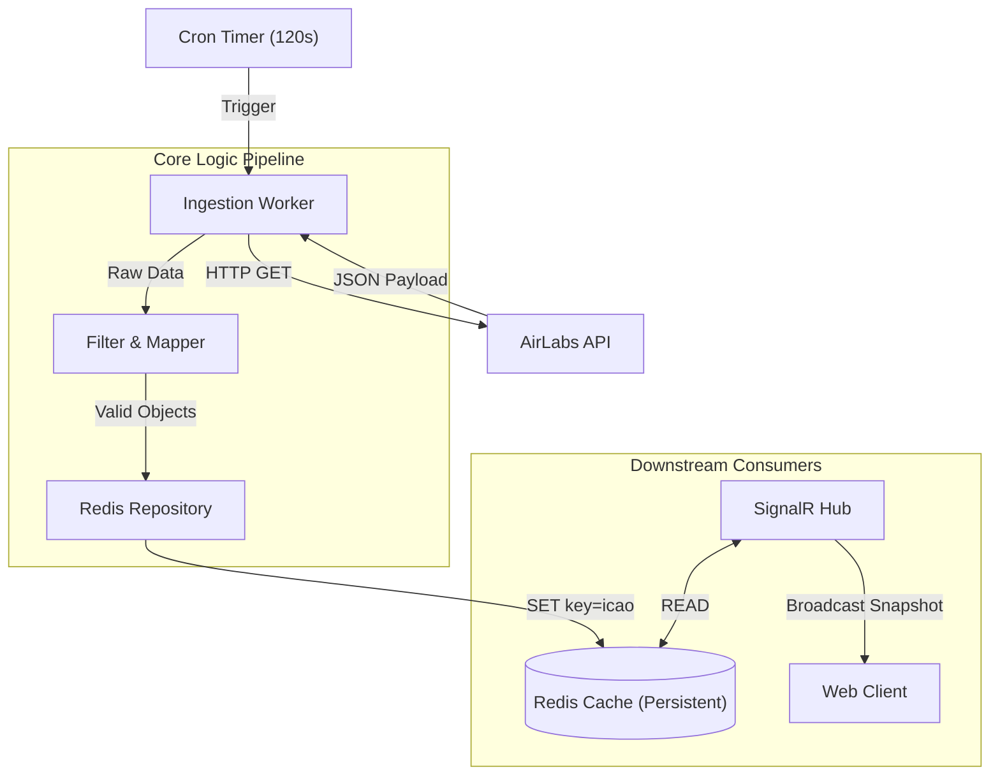

# SY-01: Data Ingestion Service (Rev. 2.0) - Architecture Analysis

## 🏛️ Executive Summary (Archon Prime)
This is a strategic pivot from "High-Frequency Polling" to **"Smart Snapshotting"**.
We are switching to **AirLabs (120s Frequency)** to operate strictly within Free Tier limits. To compensate for the low update rate, the backend transforms from a simple "pipe" into a **State Keeper**. We introduce **Redis** as the "Ground Truth Store" to persist the last known valid state of every aircraft, serving as the trusted baseline for frontend interpolation.

## 🎯 Requirements Analysis
*   **Functional (FRs)**:
    *   **Source**: Poll AirLabs API (Method: GET /flights).
    *   **Schedule**: Fixed interval **120 seconds** (Strict compliance).
    *   **Ingest & Filter**:
        *   Discard if `lat`, `lng`, `speed`, or `dir` (heading) is null/zero.
        *   Standardize proprietary AirLabs JSON keys to our Domain Model.
    *   **Persistence**: WRITE valid records to Redis with Key: `aircraft:{icao24}`.
*   **Non-Functional (NFRs)**:
    *   **Data Durability**: Data must survive service restarts (Redis AOF/RDB) to prevent "blank map" after deploy.
    *   **Cost Efficiency**: Zero API overage charges.
    *   **Scalability**: Redis handles the I/O throughput easily (approx 10k writes/2min is trivial).

## 🏗️ High-Level Architecture

*   **Description**: The Worker wakes up every 2 minutes, pulls the entire world (or region) state, filters "ghost planes", and updates the Redis "Truth Store". SignalR then broadcasts this fresh snapshot to clients to begin their interpolation cycle.

## 🧩 Component Tech Stack
| Component | Technology Choice | Justification |
| :--- | :--- | :--- |
| **Worker** | `BackgroundService` + `PeriodicTimer` | Efficient native .NET scheduling. |
| **Cache** | **Redis (StackExchange.Redis)** | **Critical Change**. Provides persistence and allows separating Ingestion (Write) from SignalR (Read). |
| **Mapping** | `System.Text.Json` | High-performance mapping from AirLabs `hex` to domain `Icao24`. |
| **Resilience** | `Polly` | Essential for external API calls (Retries with backoff). |

## ⚖️ Trade-off Analysis (The Pivot)
*   **Decision 1**: **Redis** instead of **In-Memory**
    *   *Pros*: **Persistence**. If we restart the backend to deploy code, we don't lose the flight map. With 120s intervals, waiting 2 minutes for data to reappear is bad UX. Redis keeps the map alive.
    *   *Cons*: Infrastructure complexity (Requires Redis Container).
    *   *Verdict*: **Redis**. Necessary for "Smart Snapshotting" strategy.

*   **Decision 2**: **120s Interval** instead of **10s**
    *   *Pros*: **Free**. Fits within 1,000 req/month.
    *   *Cons*: Data on screen is "old".
    *   *Mitigation*: We rely heavily on Frontend Interpolation (Math) to fake the smoothness. Backend just provides the checksum.

## 🛡️ Failure Scenarios & Mitigation
*   **What if AirLabs API times out?**:
    *   Worker logs warning.
    *   **Do NOT retry immediately** (to save quota). Wait for next 120s tick.
    *   Redis retains old data (TTL set to 5 mins). Planes don't disappear, just stop updating.
*   **What if Redis is full?**:
    *   Set `Eviction Policy`: `allkeys-lru` (though unlikely to fill with just flight text data).
