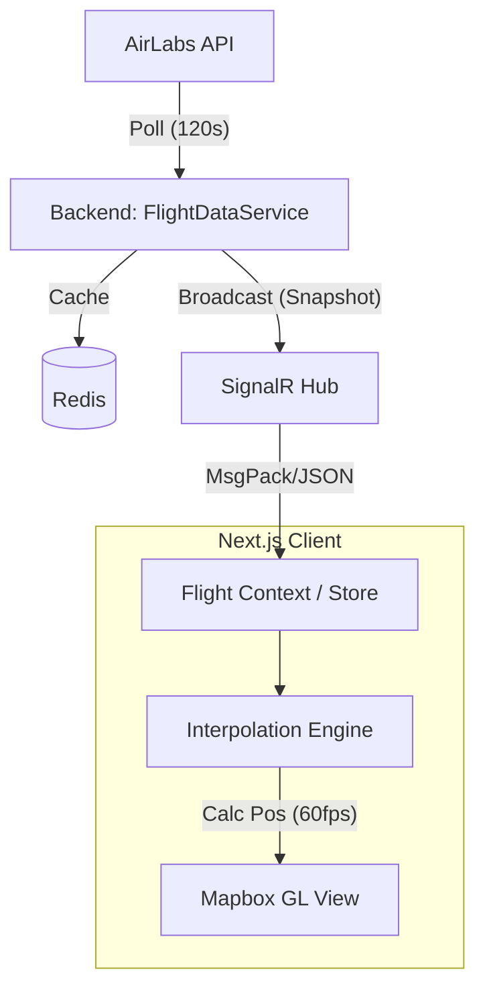

# Mission: US-01 Real-time Map View (Frontend Focus)

## 🏛️ Executive Summary
Shift focus immediately to **Frontend Implementation**. The Backend foundation (Data Ingestion + SignalR) is operational. The value of QueenFlight depends entirely on the visualization layer. We will implement a **Smart Client** architecture where the Frontend acts as the primary interpolation engine, compensating for the low-frequency polling (120s) of the AirLabs API.

## 🎯 Requirements Analysis
*   **Functional**:
    *   Display a dark-mode interactive map (Mapbox).
    *   Render aircraft icons rotating to their `TrueTrack` (heading).
    *   Animate movement smoothly between updates (60fps).
    *   Receive updates via SignalR (`FlightHub`).
*   **Non-Functional (SLA/SLO)**:
    *   **Latency**: Rendering lag < 16ms (60fps).
    *   **Bandwidth**: Minimal payload (MessagePack or optimized JSON).
    *   **Persistence**: Handle connection drops/reconnects without clearing the map.
*   **Assumptions**:
    *   Mapbox GL JS is the chosen renderer.
    *   User provides a valid Mapbox Token.
    *   Backend `FlightHub` broadcasts to "GlobalFlightData" group.

## 🏗️ High-Level Architecture

*   **Description**: The Backend is a "dumb pipe" for snapshots. The Frontend is the "smart renderer". The **Interpolation Engine** is the critical component that fakes real-time movement based on the velocity vector ($v, \theta$) received in the last snapshot.

## 🧩 Component Tech Stack
| Component | Technology Choice | Justification |
| :--- | :--- | :--- |
| **Frontend** | **Next.js 14 + Mapbox GL JS** | Next.js for structure, Mapbox for WebGL performance (handling 1000+ markers efficiently). |
| **State** | **React Context + Ref** | Avoid Redux overhead; use Refs for mutable animation state to prevent React render cycles from killing FPS. |
| **Comms** | **@microsoft/signalr** | Native integration with .NET Backend. |
| **Icons** | **Lucide React / SVG** | Lightweight, rotatable vectors. |

## ⚖️ Trade-off Analysis (Critical)
*   **Decision 1**: **Client-side Interpolation** instead of **Server-side High-freq Pushes**
    *   *Pros*: Saves massive bandwidth (Server sends 1 packet/120s, Client renders 7200 frames). Reduces server CPU load.
    *   *Cons*: Client device battery usage increases (JS math on Main Thread or Worker). Position drift if plane turns.
    *   *Verdict*: **Winner**. We must survive the AirLabs 1000 req/month limit. We cannot poll faster, so we *must* guess positions on the client.

## 🛡️ Failure Scenarios & Mitigation
*   **What if SignalR disconnects?**: Client keeps animating based on last known vector for T+60s, then fades out icons (ghosting) to indicate stale data.
*   **What if User tabs out?**: Pause animation loop (`requestAnimationFrame`) to save battery. Resync immediately on focus.

---
**Next Steps:**
1.  Initialize Next.js Map Component.
2.  Install `mapbox-gl` & `@microsoft/signalr`.
3.  Connect to `http://localhost:5000/flighthub`.
