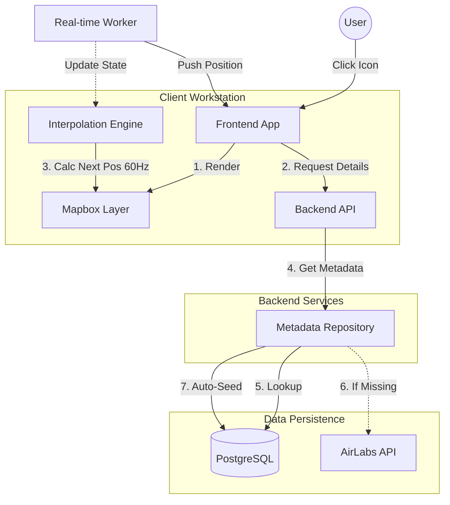
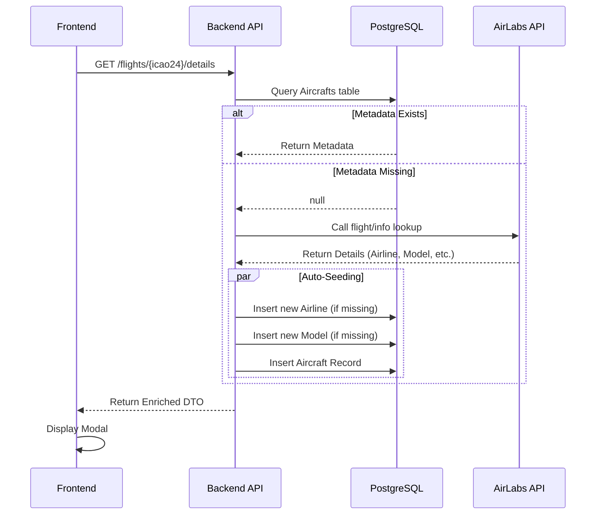

# Mission: US-02 Flight Details & Interpolation

> **Status**: Draft
> **Owner**: Archon Prime
> **Version**: 1.0.0

---

## 🏛️ Executive Summary

**US-02** focuses on closing the gap between raw, intermittent radar data and a premium, fluid user experience. The core challenge is twofold: **Visualization** (making aircraft move smoothly despite 1-5s data intervals) and **Enrichment** (instantly providing rich context like Airline logos and Manufacturer info from sparse ICAO codes).

We will implement a **Client-Side Interpolation Engine** using Dead Reckoning physics to achieve 60fps smoothness, coupled with a **Lazy-Loading Metadata Strategy** on the backend to optimize AirLabs API quota usage while ensuring data persistence.

---

## 🎯 Requirements Analysis

### Functional Requirements (FR)
1.  **Interaction**: User can click/tap an aircraft icon to view a detailed modal.
2.  **Metadata Lookup**: System must display Callsign, Airline (Name + Logo), Model, and Manufacturer.
3.  **Lazy Loading**: If metadata is missing locally, fetch from AirLabs API and cache/persist it immediately.
4.  **Interpolation**: Aircraft icons must move smoothly between position updates using Velocity and Heading.
5.  **Correction**: System must gracefully correct position differences when new real-time data arrives ("rubber-banding" or smooth convergence).

### Non-Functional Requirements (NFR - SLA/SLO)
1.  **Visual Latency**: 60fps animation (16ms frame budget).
2.  **Responsiveness**: Modal opens < 100ms (optimistic UI) or < 500ms (data fetch).
3.  **Accuracy**: Interpolated position should fall within 5% error margin of next real update.
4.  **Resilience**: Graceful display ("N/A") if external APIs fail.

### Assumptions
*   Flight data (position) comes via SignalR (already established in US-01).
*   AirLabs API key is available and has quota.
*   Frontend uses Mapbox GL JS or similar for the map layer.

---

## 🏗️ High-Level Architecture

### Data Flow & Interaction

### Sequence Diagram: Lazy Loading & Auto-Seeding

---

## 🧩 Component Tech Stack

| Component | Technology | Role & Justification |
| :--- | :--- | :--- |
| **Frontend** | **React + Mapbox GL JS** | **Mapbox** handles high-performance vector rendering. **React** manages state/modals. |
| **Animation** | **requestAnimationFrame** | standard browser API for 60fps loops. Essential for the "Physics Loop" of interpolation. |
| **Backend API** | **.NET 8 Web API** | Robust handling of concurrent requests. Clean Architecture for separation of concerns. |
| **Database** | **PostgreSQL (EF Core)** | Relational integrity for Aircraft <-> Airline <-> Model relationships. |
| **External** | **AirLabs API** | Source of truth for static metadata. |

---

## ⚖️ Trade-off Analysis

### Decision 1: Client-Side vs. Server-Side Interpolation
*   **Choice**: **Client-Side** (Deep Reckoning).
*   **Alternative**: Sending high-frequency updates from Server (e.g., 10Hz).
*   **Pros**:
    *   Massive bandwidth saving (server sends 1 update/5s instead of 50).
    *   Silky smooth 60fps local rendering regardless of network jitter.
*   **Cons**:
    *   Client CPU usage increases slightly.
    *   "Ghosting" risk: If plane turns abruptly, interpolation continues straight until correction arrives.
*   **Verdict**: **Client-Side**. The bandwidth cost of 10Hz updates for thousands of planes is prohibitive. The visual error is acceptable for a flight tracker.

### Decision 2: Lazy Loading (On-Demand) vs. Eager Loading (Stream Enrichment)
*   **Choice**: **Lazy Loading** (Fetch details only when user clicks).
*   **Alternative**: Enrich every flight in the SignalR stream with full metadata.
*   **Pros**:
    *   Saves API Quota: Only look up planes users actually care about.
    *   Reduces Payload Size: Real-time stream stays lightweight (Binary/MessagePack).
*   **Cons**:
    *   Slight delay (loading spinner) when opening modal for the first time.
*   **Verdict**: **Lazy Loading**. Optimizing payload size for the real-time stream is critical (US-01).

---

## 🛡️ Failure Scenarios & Mitigation

### 1. AirLabs API Failure / Rate Limit Exceeded
*   **Scenario**: User clicks a plane, backend tries to fetch metadata but AirLabs is down.
*   **Mitigation**:
    *   **Circuit Breaker**: Detect failures and stop calling AirLab temporarily.
    *   **Fallback**: Return a "Skeleton DTO" with just the ICAO code and "Unknown Airline".
    *   **Cache**: Use what we have in DB, even if incomplete.

### 2. Large Interpolation Error (The "Teleport" Problem)
*   **Scenario**: Plane makes a U-turn. Interpolator projects it 10km away. New update shows true position.
*   **Mitigation**:
    *   **Threshold Snapping**: If error > X km, teleport (snap) to new position immediately.
    *   **Lerp Smoothing**: If error is small, quickly animate (Lerp) from Predicted -> Actual over 500ms.

---

## 📝 Implementation Tasks

### Backend
1.  **Schema Update**: Ensure `Airlines`, `Aircrafts`, `Manufacturers` tables exist.
2.  **Service Layer**: Implement `IFlightDetailsProvider`.
3.  **Integration**: Create `AirLabsService` with resilience (Polly).
4.  **Auto-Seeding**: Logic to upsert referenced data (Airline/Model) on the fly.

### Frontend
1.  **Physics Engine**: Create `useInterpolation` hook.
2.  **Map Layer**: Render icons with rotation (`icon-rotate` property).
3.  **UI**: Build `FlightDetailModal` with Skeleton loaders.
