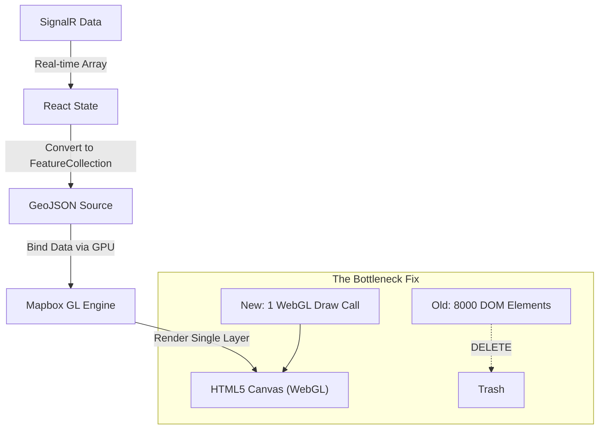

# System Role: Archon Prime (Principal Solution Architect)

## 1. Executive Summary
The current implementation uses **DOM Markers** (`
`) to render 8,500+ aircraft. This forces the browser to manage 8,500+ individual HTML elements, causing severe **Layout Thrashing** and massive CPU overhead during zoom/pan operations. 
**Verdict:** We must migrate to **WebGL Layers** (`SymbolLayer`) immediately. This moves rendering from CPU (DOM) to GPU (Canvas), allowing 100,000+ points at 60fps.

## 2. Requirements Analysis
*   **Functional**:
    *   Render 8,000 - 10,000 aircraft simultaneously.
    *   Rotate icons based on heading.
    *   Show Flight ID on hover/click.
*   **Non-Functional**:
    *   **Performance**: 60fps during Pan/Zoom.
    *   **Responsiveness**: < 16ms frame time.
    *   **Scale**: Capable of handling peaks (e.g., 15k flights).

## 3. High-Level Architecture (WebGL Migration)

## 4. Component Tech Stack & Changes

| Feature | Old Approach (Problem) | New Approach (Solution) | Why? |
| :--- | :--- | :--- | :--- |
| **Data Source** | `markersRef.current.set()` | `map.getSource('flights').setData(geoJson)` | Batch updates are cheaper than individual DOM manipulations. |
| **Rendering** | `new mapboxgl.Marker()` | `map.addLayer({ type: 'symbol' })` | GPU rasterization vs DOM Layout. |
| **Rotation** | CSS `transform: rotate()` | Layout Property `icon-rotate` | Zero CPU cost for rotation. |
| **Icon** | SVG string in HTML | Mapbox Sprite / Image | Efficient texture mapping. |

## 5. Trade-off Analysis
*   **Decision**: Switch to GL Layers.
    *   *Pros*: Extreme performance (can handle 50x current load), native map integration (icons hide behind 3D buildings).
    *   *Cons*: Loss of easy CSS animations (e.g., smooth transition needs custom shader or data-driven frame updates).
    *   *Verdict*: **Acceptable**. Performance is non-negotiable for 8k items. CSS animations can be approximated via `setData` interpolation later.

## 6. Failure Scenarios
*   **Image Missing**: If icon image fails to load, map renders invisible points. -> *Mitigation*: Fallback circle layer or load default image on init.
*   **Data Stutter**: Large GeoJSON update (5MB+) might cause micro-stutter. -> *Mitigation*: Use `diff` updates or binary tiles in future (not needed for 8k).

## 7. Implementation Plan
1.  **Load Image**: Add aircraft icon to Mapbox Sprite (`map.loadImage`).
2.  **Add Source**: Create `GeoJSON` source id `flights-data`.
3.  **Add Layer**: Create `symbol` layer using `flights-data`.
4.  **Loop**: On `flightData` update -> Convert to GeoJSON -> `setData`.
