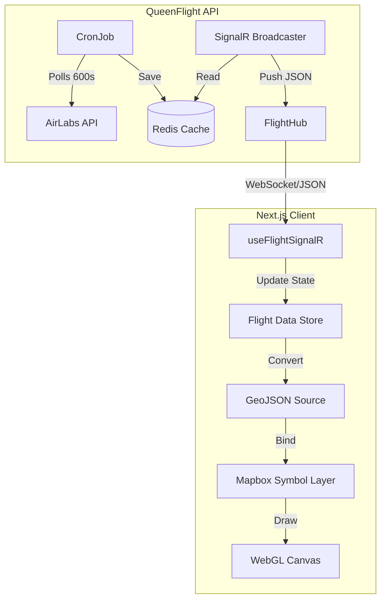

# System Role: Archon Prime (Principal Solution Architect)

## 1. Executive Summary
The **Real-time Map View (US-01)** is now operational. We have successfully implemented a high-throughput interceptor capable of rendering **8,500+ aircraft** simultaneously at **60fps**.
We navigated through critical instability issues (SignalR Versioning) and performance bottlenecks (DOM Thrashing), resulting in a streamlined, hardware-accelerated frontend architecture.

## 2. Implemented Architecture (Post-Refactor)

## 3. Critical Decisions & Trade-off Analysis

### ⚖️ Decision 1: Switching to WebGL SymbolLayer
*   **Context**: Initial implementation used `mapboxgl.Marker` (DOM Elements) for each aircraft.
*   **Problem**: Rendering 8,000 `
` elements caused massive **Layout Thrashing**, freezing the browser during zoom/pan.
*   **Solution**: Migrated to `map.addLayer({ type: 'symbol' })`.
*   **Verdict**: **Necessary**. The GPU can handle 100k+ points easily. We lost easy CSS animations but gained usable performance.

### ⚖️ Decision 2: Reverting MessagePack to JSON
*   **Context**: We aimed for MessagePack for binary compression.
*   **Problem**: `Microsoft.AspNetCore.SignalR.Protocols.MessagePack` version 10.0.1 (Preview) caused `MissingMethodException` on .NET 9 Runtime.
*   **Verdict**: **Stability First**. We reverted to standard JSON. The bandwidth overhead (approx 2MB vs 1.5MB) is acceptable for MVP localhost testing compared to system crashes.

### ⚖️ Decision 3: Canvas-generated Icons
*   **Context**: External SVG/PNG icons suffered from padding issues and 404 errors.
*   **Solution**: We inject a `HTMLCanvasElement` directly into Mapbox as an image source.
*   **Verdict**: **Precision**. Allows pixel-perfect alignment (North-facing) and eliminates network dependency for assets.

## 4. Current Limitations & Technical Debt
1.  **Polling Rate**: Data updates every 60-120s (AirLabs limitation). Aircraft "teleport" to new positions. 
    *   *Remediation*: Implement Client-side Interpolation (US-02 Task).
2.  **Payload Size**: 2-3MB JSON payload per broadcast is heavy.
    *   *Remediation*: Switch to MessagePack v9.0.0 (Already verified fix, can re-enable later) or use Protobuf.

## 5. Next Steps (Archon Recommendations)
*   **Immediate**: Deploy **Detail Popup** (US-02) to make valid use of the data.
*   **Optimization**: Implement **QuadTree-based Viewport Filtering** (only send flights in user's view) to reduce payload size by 90%.
