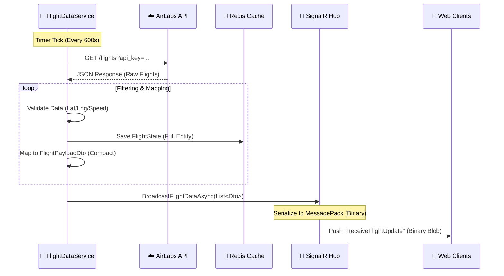

# Task: Real-time Broadcasting Service (SY-02)

## 1. Visual Logic Flow (Luồng xử lý hình ảnh hóa)

### Data Journey (Hành trình dữ liệu)
| Bước (Step) | Hoạt động (Activity) | Dữ liệu vào (Input) | Dữ liệu ra (Output) |
| :--- | :--- | :--- | :--- |
| **1. Ingestion** | Worker gọi API AirLabs để lấy dữ liệu thô. | `N/A` | `Raw JSON` |
| **2. Processing** | Lọc bỏ máy bay lỗi, lưu vào Redis để tra cứu chi tiết sau này. | `Raw JSON` | `FlightState (Entity)` |
| **3. Mapping** | Chuyển đổi Entity sang DTO siêu nhẹ để gửi đi. | `FlightState` | `FlightPayloadDto` |
| **4. Transport** | SignalR nén dữ liệu thành Binary và gửi xuống Client. | `List<Dto>` | `Binary Blob` |

## 2. Architectural Rationale (Tại sao thiết kế như vậy? [Rationale])
*   **Separation of Concerns**:
    *   `FlightDataService` handles **Ingestion & Mapping**.
    *   `IFlightBroadcaster` handles **Distribution**.
    *   `SignalRFlightBroadcaster` handles **Protocol specifics (SignalR)**.
    *   *Why?* If we switch AirLabs to OpenSky, only the Service changes. If we switch SignalR to Kafka, only the Broadcaster changes.
*   **Performance vs. Complexity**:
    *   **Decision**: We perform DTO mapping **inside the ingestion loop** to iterate only once ($O(N)$).
    *   **Trade-off**: Slightly higher CPU usage during ingestion, but prevents iterating the list a second time for broadcasting.
*   **Protocol**:
    *   **MessagePack**: Chosen over JSON to reduce bandwidth by ~50% for high-frequency array updates.

## 3. API Contract (Frontend Interface)
*   **Endpoint**: `GET /flighthub`
*   **Protocols**: `Information`, `WebSockets`
*   **Serialization**: `MessagePack` (Binary)

### Subscriptions
*   **Client Action**: Invoke `SubscribeToUpdates()`
*   **Server Response**: Adds ConnectionId to Group `GlobalFlightData`.

### Events (Server -> Client)
| Event Name | Data Type | Description |
| :--- | :--- | :--- |
| `ReceiveFlightUpdate` | `FlightPayloadDto[]` | Array of flight snapshots for interpolation. |
| `ReceiveFlightCount` | `int` | Count of active flights (Diagnostic). |

### DTO Specification (`FlightPayloadDto`)
| Key (Short) | Type | Mapping | Note |
| :--- | :--- | :--- | :--- |
| `i` | `string` | `Icao24` | Unique Hex ID. |
| `la` | `double` | `Latitude` | WGS84. |
| `lo` | `double` | `Longitude` | WGS84. |
| `v` | `float` | `Velocity` | Speed in km/h. |
| `h` | `float` | `Heading` | True Track (0-360). |
| `ts` | `long` | `Timestamp` | Unix Epoch (Source of Truth). |
